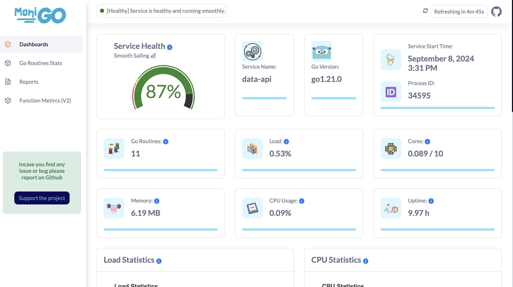

### Status: In Development 🚧

<p align="center">
  
</p>

# MoniGo - Performance Monitoring for Go Applications

[](https://goreportcard.com/report/github.com/iyashjayesh/monigo)
[](https://pkg.go.dev/github.com/iyashjayesh/monigo)
[](https://opensource.org/licenses/Apache-2.0)

**MoniGo** is a performance monitoring library for Go applications. It provides real-time insights into application performance with an intuitive user interface, enabling developers to track and optimize both service-level and function-level metrics.



## Features

- **Real-Time Monitoring**: Access up-to-date performance metrics for your Go applications.
- **Detailed Insights**: Track and analyze both service and function-level performance.
- **Customizable Dashboard**: Manage performance data with an easy-to-use UI.
- **Visualizations**: Utilize graphs and charts to interpret performance trends.

## Installation

To install MoniGo, use the following command:

```bash
go get github.com/iyashjayesh/monigo
```

## Example: How to Use MoniGo

```go
package main

import (
    "github.com/iyashjayesh/monigo"
)

func main() {

	monigoInstance := &monigo.Monigo{
		ServiceName:        "service_name", // **Required**
		PurgeMonigoStorage: true,       	// Default is false
		DashboardPort:      8080,       	// Default is 8080
		DataPointsSyncFrequency:    "10s",       	// Default is 5 Minutes "5m"
		RetentionPeriod:    "4d",       	// Default is 14 days (2 weeks)
	}

	// **Thresholds Explanation:**

	// The `Thresholds` structure defines the performance and resource usage thresholds used to evaluate system health:

	// - **Low**: The percentage value below which the system is considered to be in optimal health.
	// - **Medium**: The percentage value indicating moderate health; usage above this threshold but below the High threshold may be acceptable but should be monitored.
	// - **High**: The percentage value indicating high usage, suggesting potential performance issues or resource constraints.
	// - **Critical**: The percentage value where the system is critically stressed and immediate attention is needed.
	// - **GoroutinesLow**: The lower bound for the number of goroutines; fewer goroutines are considered better.
	// - **GoroutinesHigh**: The upper bound for the number of goroutines; more goroutines may indicate high load or potential inefficiencies.

	// Example values:
	// - `Low: 20.0` - The system is healthy if usage is below 20%.
	// - `Medium: 50.0` - Usage between 20% and 50% is moderate.
	// - `High: 80.0` - Usage between 50% and 80% is high.
	// - `Critical: 100.0` - Usage at or above 100% is critical.

	// For goroutines:
	// - `GoroutinesLow: 100` - Ideal number of goroutines is below 100.
	// - `GoroutinesHigh: 500` - The system may experience performance issues if the number of goroutines exceeds 500.

	monigoInstance.ConfigureServiceThresholds(&models.ServiceHealthThresholds{
		Low:            20.0,  // Default is 20.0
		Medium:         50.0,  // Default is 50.0
		High:           80.0,  // Default is 80.0
		Critical:       100.0, // Default is 100.0
		GoRoutinesLow:  100,   // Default is 100
		GoRoutinesHigh: 500,   // Default is 500
	})

	monigoInstance.Start()

	// Optinal
	// routinesStats := monigoInstance.PrintGoRoutinesStats() // Print go routines stats
	// log.Println(routinesStats)

    select {} // To keep the program running
}
```

For more detailed usage instructions, refer to the documentation.

By default, the dashboard will be available at http://localhost:8080/.

You can access the dashboard by visiting the following URL: http://localhost:8080/

Reports need to be generated by the user by clicking on the "Generate Report" button on the Reports page.

## Bellow Reports are available:

1. **Load Statistics**: Provides an overview of the overall load of the service, CPU load, memory load, and system load.

| Field Name                | Value (Datatype) |
| ------------------------- | ---------------- |
| `overall_load_of_service` | `float64`        |
| `service_cpu_load`        | `float64`        |
| `service_memory_load`     | `float64`        |
| `system_cpu_load`         | `float64`        |
| `system_memory_load`      | `float64`        |

2. **CPU Statistics**: Displays the total number of cores, cores used by the service, and cores used by the system.

| Field Name              | Value (Datatype) |
| ----------------------- | ---------------- |
| `total_cores`           | `int`            |
| `cores_used_by_service` | `int`            |
| `cores_used_by_system`  | `int`            |

3. **Memory Statistics**: Shows the total system memory, memory used by the system, memory used by the service, available memory, GC pause duration, and stack memory usage.

| Field Name               | Value (Datatype) |
| ------------------------ | ---------------- |
| `total_system_memory`    | `float64`        |
| `memory_used_by_system`  | `float64`        |
| `memory_used_by_service` | `float64`        |
| `available_memory`       | `float64`        |
| `gc_pause_duration`      | `float64`        |
| `stack_memory_usage`     | `float64`        |

4. **Memory Profile**: Provides information on heap allocation by the service, heap allocation by the system, total allocation by the service, and total memory by the OS.

| Field Name               | Value (Datatype) |
| ------------------------ | ---------------- |
| `heap_alloc_by_service`  | `float64`        |
| `heap_alloc_by_system`   | `float64`        |
| `total_alloc_by_service` | `float64`        |
| `total_memory_by_os`     | `float64`        |

5. **Network IO**: Displays the number of bytes sent and received.

| Field Name       | Value (Datatype) |
| ---------------- | ---------------- |
| `bytes_sent`     | `float64`        |
| `bytes_received` | `float64`        |

6. **Overall Health**: Provides an overall health percentage for the service.

| Field Name               | Value (Datatype) |
| ------------------------ | ---------------- |
| `overall_health_percent` | `float64`        |

## API Reference

- You can access the MoniGo API by visiting the following URL: http://localhost:8080/monigo/api/v1/<endpoint> (replace `<endpoint>` with the desired endpoint).
- API endpoints are available for the following:

| Endpoint                           | Description           | Method | Request                                             | Response | Example                                          |
| ---------------------------------- | --------------------- | ------ | --------------------------------------------------- | -------- | ------------------------------------------------ |
| `/monigo/api/v1/metrics`           | Get all metrics       | GET    | None                                                | JSON     | [Example](./docs/API/Res/metrics.json)           |
| `/monigo/api/v1/go-routines-stats` | Get go routines stats | GET    | None                                                | JSON     | [Example](./docs/API/Res/go-routines-stats.json) |
| `/monigo/api/v1/service-info`      | Get service info      | GET    | None                                                | JSON     | [Example](./docs/API/Res/service-info.json)      |
| `/monigo/api/v1/service-metrics`   | Get service metrics   | POST   | JSON [Example](./docs/API/Req/service-metrics.json) | JSON     | [Example](./docs/API/Res/service-metrics.json)   |
| `/monigo/api/v1/reports`           | Get history data      | POST   | JSON [Example](./docs/API/Req/reports.json)         | JSON     | [Example](./docs/API/Res/reports.json)           |

## Contributing

We welcome contributions! If you encounter any issues or have suggestions, please submit a pull request or open an issue.

For more information on how to contribute, please refer to the CONTRIBUTING.md file.

If you find MoniGo useful, consider giving it a star! ⭐

## Contact

For questions or feedback, please open an issue or contact me at iyashjayesh@gmail.com

<!-- ## Star History

[](https://star-history.com/#iyashjayesh/monigo&Date) -->

## License

This project is licensed under the Apache 2.0 License - see the [LICENSE file](https://github.com/iyashjayesh/monigo?tab=Apache-2.0-1-ov-file) for details.
